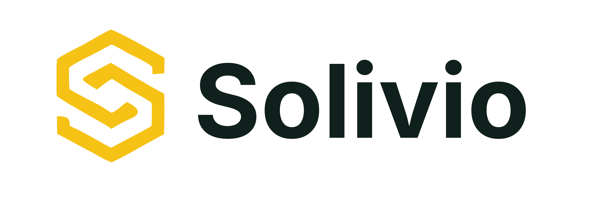

<p align="center">
  
</p>

<p align="center">
  <strong>Open-source foundation for AI-assisted sales quoting.</strong>
  <br />
  Turn customer requests, product knowledge, and past context into reviewed offer drafts.
</p>

<p align="center">
  <a href="https://solivio.ai">Website</a>
  ·
  <a href="./apps/docs/src/content/docs/guides/getting-started.md">Getting started</a>
  ·
  <a href="./apps/docs/src/content/docs/guides/features.md">Feature walkthrough</a>
  ·
  <a href="./apps/docs/src/content/docs/guides/modules.md">Modules guide</a>
</p>

Solivio helps sales teams handle quoting workflows where product catalogs are
large, offers contain many line items, and the knowledge needed to prepare a
good quote is spread across systems and people.

The product path is intentionally practical: a customer sends a request,
Solivio extracts requirements, searches the catalog, prepares a draft offer,
and keeps a salesperson in the loop to review, edit, validate, accept, and
export the final result. The public product and implementation story lives at
[solivio.ai](https://solivio.ai); this repository is the open-source software
foundation behind it.

Solivio is created by
[Derave](https://derave.dev/en/?utm_source=solivio.ai&utm_medium=referral&utm_campaign=solivio_landing&utm_content=en_readme_attribution)
and released under the MIT license.

## What Solivio Does

Solivio is built for quote processes that are too manual, too inconsistent, or
too dependent on individual sales experts. In its current open-source shape, it
provides:

- product catalog import, search, embeddings, and product matching,
- customer and intake request management,
- AI-assisted draft offer generation from raw customer input,
- an offer review workspace with editable line items, validation, revisions,
  PDF preview, and acceptance flow,
- an offer assistant that can answer questions and help edit drafts,
- historical order recall for agents when repeat buying patterns matter,
- an internal knowledge base with semantic retrieval that grounds the agents in company-specific rules,
- CSV import capabilities for products, customers, and historical orders,
- a modular architecture for company-specific integrations and workflows.

The goal is not to remove the salesperson from the process. The goal is to
remove repetitive operational work, make quoting knowledge easier to reuse, and
turn the route from inquiry to reviewed offer into a clearer, faster pipeline.

## How The Product Works

1. A customer request is entered or imported.
2. Solivio reads the request with available business context: catalog data,
   customer data, past orders, pricing notes, and implementation-specific
   guidance.
3. Agents extract requirements, match products, and prepare a structured draft.
4. A salesperson reviews the draft, edits line items, uses the assistant when
   helpful, checks validation signals, and accepts or revises the offer.
5. Accepted offers can be previewed and downloaded as PDFs. Downstream steps
   such as ERP sync, approval workflows, or final document templates are meant
   to be implemented through modules.

## Repository Shape

Solivio is a modular monolith. The core app stays small; feature code lives in
modules that are compiled into the app at build time.

| Path | Purpose |
| --- | --- |
| [`apps/solivio`](./apps/solivio) | The Next.js app: auth, app shell, runtime boot, health checks, migrations, and generated module wiring. |
| [`modules`](./modules) | First-party feature modules such as catalog, customers, offers, offer chat, knowledge base, CSV import, order history, and product sync. |
| [`sdk`](./sdk) | `@solivio/sdk`, the public contract modules build against. |
| [`packages/domain`](./packages/domain) | Shared domain types, workflow constants, and fixtures. |
| [`packages/ui`](./packages/ui) | Shared shadcn/ui component kit. |
| [`packages/theme`](./packages/theme) | Design tokens used by the app and modules. |
| [`scripts/generate`](./scripts/generate) | Build-time module discovery, validation, and code generation. |
| [`docs`](./docs) | Contributor architecture, module, database, testing, API, and ADR documentation. |
| [`apps/docs`](./apps/docs) | User-facing documentation site source. |
| [`infra/postgres`](./infra/postgres) | Local Postgres bootstrap files. |

## Modules

Modules are TypeScript source packages under `modules/<id>/`. Each module can
contribute pages, API routes, services, events, jobs, agent tools, importers,
translations, navigation entries, UI slots, permissions, and its own Drizzle
migration journal.

`solivio.config.ts` is the deployment manifest. `yarn generate` reads it,
discovers enabled modules by file convention, validates the module graph, and
emits the app-router stubs and registries the Next.js app builds against.
Enabling a module is therefore a config + regenerate + rebuild operation, not a
runtime plugin install.

The default repository configuration enables:

- `catalog` - products, prices, embeddings, and semantic search,
- `customers` - customers and intake requests,
- `offers` - offer drafts, line items, revisions, PDF rendering, and offer UI,
- `offer-chat` - review chat threads, messages, and the salesperson copilot,
- `order-history` - agent tools for recalling a customer's past orders,
- `knowledge-base` - internal knowledge base with semantic retrieval for agents,
- `csv-import` - CSV importers for products, customers, and historical orders,
- `products-sync` - a reference scheduled product-sync module.

Start with the [Modules guide](./apps/docs/src/content/docs/guides/modules.md)
for the operating model, then use
[docs/module-system.md](./docs/module-system.md),
[docs/codegen.md](./docs/codegen.md), and
[docs/contracts.md](./docs/contracts.md) when authoring modules or changing the
module boundary. `modules/products-sync` is the reference example for the full
module surface.

## Local Setup

Requirements:

- Node.js `>=24.15.0`
- Yarn `>=4.14.1`
- Docker

Start from source:

```bash
yarn install
cp apps/solivio/.env.example apps/solivio/.env.local
yarn setup
yarn dev
```

Before the first run, set `BETTER_AUTH_SECRET` in
`apps/solivio/.env.local`. A local value can be generated with:

```bash
openssl rand -base64 32
```

`OPENAI_API_KEY` is optional for launching the app. Without it, AI-backed
features such as embeddings, semantic search, offer generation, and the offer
assistant are unavailable; the rest of the app still runs.

Open `http://localhost:3000`, create the first user from the login screen, and
load example data if you want content to explore:

```bash
yarn seed
```

For the Docker image path, see the
[Getting started guide](./apps/docs/src/content/docs/guides/getting-started.md).
The published image is `ghcr.io/solivio-ai/solivio-app`.

## Useful Commands

```bash
yarn dev                        # generator watch mode + Next.js on :3000
yarn setup                      # start Postgres, generate wiring, apply migrations
yarn generate                   # regenerate module registries and app-router stubs
yarn biome check --write .      # format, sort imports, apply safe lint fixes
yarn check                      # Biome + module boundary checker
yarn typecheck                  # type-check all workspaces
yarn test                       # Vitest suite
yarn e2e                        # Playwright smoke tests
yarn docs:dev                   # local docs site on :4321
yarn validate                   # generate --check + check + typecheck + tests
yarn validate:all               # full local handoff suite
```

Run `yarn generate` after changing module files or `solivio.config.ts`. Run
`yarn setup` on a fresh checkout and again after new migrations are added.

## Documentation Map

- [Getting started](./apps/docs/src/content/docs/guides/getting-started.md) -
  Docker quick start and source checkout.
- [Feature walkthrough](./apps/docs/src/content/docs/guides/features.md) -
  import a catalog, generate a draft, review, chat, accept, and download.
- [Modules guide](./apps/docs/src/content/docs/guides/modules.md) - how a
  deployment chooses and configures modules.
- [Extending Solivio](./apps/docs/src/content/docs/guides/extending.md) - custom
  modules without forking the base repository.
- [Architecture](./docs/architecture.md) - core/module split, pipeline shape,
  extension surfaces, and out-of-scope boundaries.
- [Module system](./docs/module-system.md) - module anatomy and authoring rules.
- [Code generation](./docs/codegen.md) - what `yarn generate` reads, validates,
  and emits.
- [SDK contracts](./docs/contracts.md) - the public `@solivio/sdk` surface.
- [Database](./docs/database.md) and [ERD](./docs/erd.md) - schema ownership and
  migration model.
- [API](./docs/api.md) - route conventions and OpenAPI contract docs.
- [Testing](./docs/testing.md) - Vitest, module tests, and Playwright strategy.
- [Publishing](./docs/publishing.md) and
  [Deployment](./apps/docs/src/content/docs/guides/deployment.md) - image build
  and production deployment notes.

## Agent Benchmarks

The AI benchmark suite lives in
[`apps/solivio/benchmarks`](./apps/solivio/benchmarks/README.md). It contains a
fixed set of offer-generation scenarios and deterministic scoring rules for
tracking agent quality over time.

```bash
yarn benchmark
yarn benchmark:report
```

## Contributing

Contributions should keep the default demo path simple, documented, and
runnable without mandatory external services.

When adding functionality:

- keep feature code inside modules whenever it belongs to a business domain,
- use `@solivio/sdk` and `@solivio/sdk/runtime` instead of app internals,
- preserve module boundaries: no runtime imports between modules, no SQL joins
  across module tables, and no module-owned access to app internals,
- prefer mocks until the data model and integration boundary are clear,
- document new setup, environment, migration, or operator requirements,
- run `yarn biome check --write .`, `yarn check`, and `yarn test` before
  handing changes back; add `yarn typecheck` for TypeScript, server, API, or
  React behavior changes.

If you are new to the codebase, read
[docs/architecture.md](./docs/architecture.md) and
[apps/docs/src/content/docs/guides/modules.md](./apps/docs/src/content/docs/guides/modules.md)
before making structural changes.
