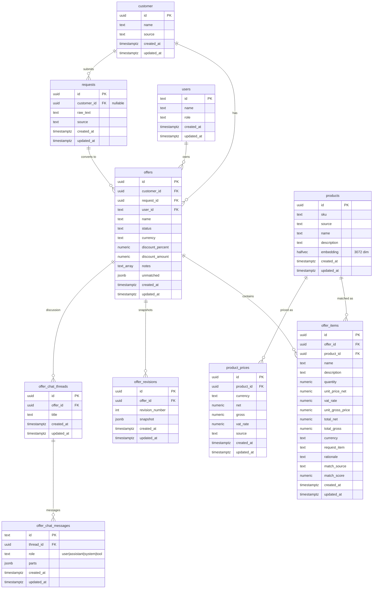

# Database Schema — Offering

Scope: quoting domain (customers, products, requests, offers, items, revisions, chat)

This document is the canonical ERD for the offering pipeline. Stack-level details (Docker image, pgvector version) live in `database.md`. Lifecycle and architecture context lives in `architecture.md`.

## Diagram

## Notes

### `match_source` values
- `exact` — SKU match
- `semantic` — pgvector top-1 (with LLM rerank in current pipeline)
- `manual` — added by salesperson via UI / chat

### `match_score`
- `exact` → `1.0`
- `semantic` → cosine similarity of picked candidate
- `manual` → `null`

### Computed totals (`offer_items`)
Computed in the application service layer on write, persisted as plain numeric columns:
- `unit_gross_price = unit_price_net * (1 + vat_rate / 100)`
- `total_net = quantity * unit_price_net`
- `total_gross = quantity * unit_price_net * (1 + vat_rate / 100)`

### `offer_chat_messages.parts`
Array of typed message parts: `text`, `tool-call`, `tool-result`, `reasoning`, `file`, `source`. Persisted as `jsonb` to keep the chat agent message shape verbatim across turns.

### `users`
Better Auth table. Real schema also includes `session`, `account`, `verification` — omitted here as they are auth infrastructure, not offering domain.

### Status values (`offers.status`)
Initial set: `draft`, `accepted`, `rejected`.

### Nullability
- `requests.customer_id` — nullable (request may arrive before customer match)
- `offers.request_id` — nullable (offer may be created without a tracked request)
- `offer_items.product_id` — nullable (custom items without catalog product)
